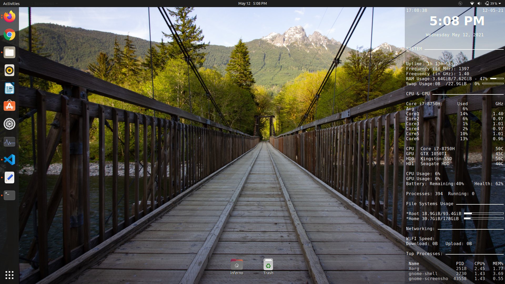
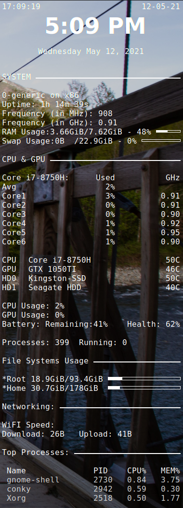

# Linux System Monitoring Widget

---

## In this repo, I share my own conky-widget theme, that I use to monitor my linux system. 

 

 

## With this conky widget theme you can monitor the following items, if present in your Linux Computer:

 

- ## Date and Time
- ## System
  - ### Device Name and Kernal Version
  - ### RAM Frequency in MHZ and GHZ
  - ### Ram Usage
  - ### Swap partiotion Usage
- ## CPU & GPU
  - ### Core Clock Usage and Speed of 6 Cores
  - ### CPU Temperature
  - ### GPU Temperature
  - ### HDD Temperature
  - ### SSD Temperature 
  - ### Battery Remaining and Health
  - ### Number of System Processes and User Processes
- ## File System Usage
  - ### Root Storage stats
  - ### Home Storage Stats
- ## Networking 
  - ### Wifi (Download and Upload Speeds)
- ## Top Processes
  - ### Name, Process ID, CPU Usage and Memory Usage of top 3 processes
  
---

 

# Installation Instructions

## Installing Conky

### Installation on Debian and Ubuntu are as swift as can be via the terminal: 

`sudo apt install conky`

 

### To install on Fedora: 

`sudo yum install conky`

 

### To install on Arch: 

`pacman -S conky`

 

# Using and configuring Conky

1. Download the .conky.rc file provided here. 
2. For most of the linux distros(like Ubuntu) placing the .conky.rc in the home folder will work. But if it doesn't, try replacing it with the .conky.rc file present in /etc/conky.
3. Conky uses a ".conkyrc" file to store all of its display settings. It is located in "/etc/conky/" folder. These settings can be manipulated by any text editor or the conky manager. A few of the included settings are screen position, update interval and font color. 
4. You might want to edit some of the settings in the .conky.rc file provided here to remove some sensors which are not present in your system, or simply to change the refresh time for some sensors. 